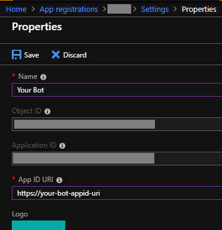

# Notifications in Calling

> **Important:** APIs for Calling in Microsoft Graph are in preview and are subject to change. Use of these APIs in production applications is not supported.

Refer to [Calls Api Overview](../api-reference/beta/resources/calls-api-overview.md) on how to register the callback URL. This callback is used for all incoming calls to the application.

## Protocol determination
The incoming notification is provided in legacy format for compatibility with the previous [protocol](https://docs.microsoft.com/en-us/azure/bot-service/dotnet/bot-builder-dotnet-real-time-media-concepts?view=azure-bot-service-3.0). In order to convert the call to the Microsoft Graph protocol, the bot must determine the notification is in legacy format and reply with:

```http
HTTP/1.1 204 No Content
```

The application will again receive the notification but this time it will be in the Microsoft Graph protocol.

You may configure the protocol your application supports and avoid receiving the initial callback in legacy format. The setting is available as a configuration option in the Skype Channel.

## Redirects for region affinity

We will invoke your callback from the data-center hosting the call. The call may start in any data-center and does not take into account region affinities. The notification will be sent to your deployment depending on the GeoDNS resolution. If your application determines, by inspecting the initial notification payload or otherwise, that it needs to run in a different deployment, the application may reply with:

```http
HTTP/1.1 302 Found
Location: your-new-location
```

You may decide to pickup the call and [answer](../api-reference/beta/api/call_answer.md). You can specify the callback URL to handle this particular call. This is useful for _stateful_ instances where your call is handled by a particular partition and you want to embed this information on the callback URL for routing to the right instance.

## Authenticating the callback

Application should inspect the token passed by on the notification to validate the request. Whenever the API raises a web hook event, the API gets an OAUTH token from us, with audience as the application's App ID and adds it in the Authorization header as a Bearer token.



The application is expected to validate this token before accepting the callback request.

```http
POST https://bot.contoso.com/api/calls
Content-Type: application/json
Authentication: Bearer <TOKEN>

"value": [
    "subscriptionId": "2887CEE8344B47C291F1AF628599A93C",
    "subscriptionExpirationDateTime": "2016-11-20T18:23:45.9356913Z",
    "changeType": "updated",
    "resource": "/app/calls/8A934F51F25B4EE19613D4049491857B",
    "resourceData": {
        "@odata.type": "#microsoft.graph.call",
        "state": "Established"
    }
]
```

The OAUTH token would have values like the following, and will be signed by us. The openid configuration published at https://api.aps.skype.com/v1/.well-known/OpenIdConfiguration can be used to verify the token.

```json
{
    "aud": "0efc74f7-41c3-47a4-8775-7259bfef4241",
    "iss": "https://api.botframework.com",
    "iat": 1466741440,
    "nbf": 1466741440,
    "exp": 1466745340,
    "tid": "31537af4-6d77-4bb9-a681-d2394888ea26"
}
```

* **aud** audience is the App ID URI specified for the application.
* **tid** is the tenant id for contoso
* **iss** is the token issuer, `https://api.botframework.com`

The listener interface on the web hook URL can validate the token, ensure it has not expired, checking whether it has been signed by our published openid configuration. You must also check whether audience matches your App ID before accepting the callback request.

[Sample](https://github.com/microsoftgraph/microsoft-graph-comms-samples/blob/master/Samples/Common/Sample.Common/Authentication/AuthenticationProvider.cs) shows how to validate inbound requests.

&nbsp;

> **Important upcoming changes:**

In future, we are migrating to sending you OAUTH tokens issued by Azure Active Directory. Hence, you should be ready for the migration and code up to accept both kinds of tokens.

The new token would look like following.

```json
{
    "aud": "0efc74f7-41c3-47a4-8775-7259bfef4241",
    "iss": "https://sts.windows.net/31537af4-6d77-4bb9-a681-d2394888ea26/",
    "iat": 1466741440,
    "nbf": 1466741440,
    "exp": 1466745340,
    "appid": "26a18ebc-cdf7-4a6a-91cb-beb352805e81",
    "appidacr": "2",
    "oid": "2d452913-80c9-4b56-8419-43a7da179822",
    "sub": "MF4f-ggWMEji12KynJUNQZphaUTvLcQug5jdF2nl01Q",
    "tid": "b9419818-09af-49c2-b0c3-653adc1f376e",
    "ver": "1.0"
}
```

* **aud** audience is the App ID specified for the application.
* **tid** is the tenant id for contoso
* **iss** is the token issuer, `https://sts.windows.net/{tenantId}/`
* **appid** is the appid of our service 

The listener interface on the web hook URL can validate the OAUTH token, ensure it has not expired, checking whether AAD issued and signed the token. You must also check whether audience matches your App ID before accepting the callback request.


## Additional information

You can read more about [AAD Token Validation](http://www.cloudidentity.com/blog/2014/03/03/principles-of-token-validation/)
