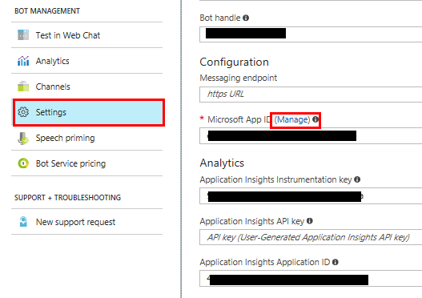

# Registering a calling bot

> **Important:** APIs for Calling in Microsoft Graph are in preview and are subject to change. Use of these APIs in production applications is not supported.

In this topic you will learn how to register a new Calling Bot.

## Register your bot in the Azure Bot Service

Complete the following steps:
1. Register a bot through [Azure Bot Channel Registration](https://docs.microsoft.com/en-us/azure/bot-service/bot-service-quickstart-registration).
1. Once you complete the registration, take a note of the registered config values (Bot Name, Application Id, and Application Secret).  You will need these values later in the code samples.
1. Enable the Microsoft Teams channel and enable calling on the Calling tab.  Fill in the Webhook (for calling) where you will receive incoming notifications. E.g. `https://{your domain}/api/calls`. Refer to [Connect a bot to channels](https://docs.microsoft.com/en-us/azure/bot-service/bot-service-manage-channels) for more information on how to configure channels.


## Permissions

### Add Microsoft Graph permissions for calling to your bot

Microsoft Graph exposes granular permissions controlling the access apps have to resources. As a developer, you decide which permissions for Microsoft Graph your app requests.  The Microsoft Graph Calling APIs support Application permissions, which are used by apps that run without a signed-in user present; for example, apps that run as background services or bots.  Application permissions can only be consented by a tenant administrator.  Calling bots and applications have some capabilties that will need tenant administrator consent.  Below is a list of those permissions:

|Permission|Display String|Description|Admin Consent Required|
|---| ------------- |---|--|
|Calls.Initiate.All|Initiate outgoing 1:1 calls from the app (preview)|Allows the app to place outbound calls to a single user and transfer calls to users in your organization’s directory, without a signed-in user.|Yes|
|Calls.InitiateGroupCall.All|Initiate outgoing group calls from the app (preview)|Allows the app to place outbound calls to multiple users and add participants to meetings in your organization, without a signed-in user.|Yes|
|Calls.JoinGroupCall.All|Join Group Calls and Meetings as an app (preview)|Allows the app to join group calls and scheduled meetings in your organization, without a signed-in user.  The app will be joined with the privileges of a directory user to meetings in your tenant.|Yes|
|Calls.JoinGroupCallasGuest.All|Join Group Calls and Meetings as a guest (preview)|Allows the app to anonymously join group calls and scheduled meetings in your organization, without a signed-in user.  The app will be joined as a guest to meetings in your tenant.|Yes|
|Calls.AccessMedia.All \*see below\*|Access media streams in a call as an app (preview)|Allows the app to get direct access to participant media streams in a call, without a signed-in user.|Yes|

> **Important:** You may not use the Microsoft.Graph.Calls.Media API to record or otherwise persist media content from calls or meetings that your bot accesses.

### Assigning permissions

You pre-configure the application permissions your app needs when you register your app.  To add permissions from the Azure Bot Registration Portal:

* From the **Settings** blade, click **Manage**. This is the link appearing by the **Microsoft App ID**. This link will open a window where you can scroll down to add Microsoft Graph Permissions: under **Microsoft Graph**, choose **Add** next to **Application Permissions** and then select the permissions your app requires in the **Select Permissions** dialog. <br/>
  

You can also add permissions by accessing your app through the [Microsoft App Registration Portal](https://apps.dev.microsoft.com/).

### Getting administrator consent

An administrator can either consent to these permissions using the [Azure portal](https://portal.azure.com) when your app is installed in their organization, or you can provide a sign-up experience in your app through which administrators can consent to the permissions you configured. Once administrator consent is recorded by Azure AD, your app can request tokens without having to request consent again.

You can rely on an administrator to grant the permissions your app needs at the [Azure portal](https://portal.azure.com), but often a better option is to provide a sign-up experience for administrators by using the Azure AD v2.0 `/adminconsent` endpoint.  Please refer to the [instructions on constructing an Admin Consent URL](https://developer.microsoft.com/graph/docs/concepts/auth_v2_service#3-get-administrator-consent) for more detail.

> **Note**: Constructing the Tenant Admin Consent URL requires a configured Redirect URI/Reply URL in the [App Registration Portal](https://apps.dev.microsoft.com/). To add reply URLs for your bot, access your bot registration, choose Advanced Options > Edit Application Manifest.  Add your Redirect URI to the field replyURLs.

> **Important**: Any time you make a change to the configured permissions, you must also repeat the Admin Consent process. Changes made in the app registration portal will not be reflected until consent has been reapplied by the tenant's administrator.

## Register bot in Microsoft Teams

The code samples can be used in combination with a Microsoft Teams App Manifest settings to add the Calling and Video buttons for a 1:1 bot interaction.  To develop calling bot, add 'supportsCalling' and 'supportsVideo' boolean properties to the bots section in the app manifest and the bot is all set to receive calls once installed (either to a personal context or a team).  App Manifests can be uploaded through the [App Studio](https://docs.microsoft.com/en-us/microsoftteams/platform/get-started/get-started-app-studio) in the Microsoft Teams client.

```json
{
  "$schema": "https://raw.githubusercontent.com/OfficeDev/microsoft-teams-app-schema/preview/DevPreview/MicrosoftTeams.schema.json",
  "manifestVersion": "1.3",
  "version": "1.0.0",
  "id": "%MICROSOFT-APP-ID%",
  "packageName": "com.example.myapp",
  "developer": {
    "name": "Publisher Name",
    "websiteUrl": "https://website.com/",
    "privacyUrl": "https://website.com/privacy",
    "termsOfUseUrl": "https://website.com/app-tos"
  },
  "name": {
    "short": "Name of your app (<=30 chars)",
    "full": "Full name of app, if longer than 30 characters"
  },
  "description": {
    "short": "Short description of your app",
    "full": "Full description of your app"
  },
  "icons": {
    "outline": "%FILENAME-32x32px%",
    "color": "%FILENAME-192x192px"
  },
  "accentColor": "%HEX-COLOR%",
  "bots": [
    {
      "botId": "%MICROSOFT-APP-ID-REGISTERED-WITH-BOT-FRAMEWORK%",
      "needsChannelSelector": false,
      "isNotificationOnly": false,
      "scopes": [ "team", "personal", "groupchat" ],
      "supportsCalling": true,
      "supportsVideo": true
    }
  ]
}
```