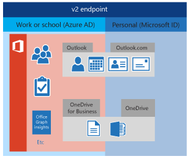

# Authenticate Microsoft Graph apps with the v2 authentication endpoint

> **Important:** While the Azure AD v2.0 endpoint supports users authenticating with work or school accounts as well as personal accounts, it does not support [conditional access device policies](https://azure.microsoft.com/en-us/documentation/articles/active-directory-conditional-access-device-policies/). Because of this, if your app requires enterprise authentication (that is, using work or school accounts), it is strongly recommended you use Azure AD authentication.
> 
> For more information, see [Deciding between the Azure AD and Azure AD v2.0 endpoints](../Auth_overview.md#deciding-between-azure-ad-and-the-v2-authentication-endpoint).

## Signing in Microsoft account and Azure AD users with a single authentication model

By using the Azure AD v2.0 endpoint, you can create apps that accept both work and school (Azure Active Directory) as well as personal (Microsoft account) identities.

In the past, if you wanted to develop an app to support both Microsoft accounts and Azure Active Directory, you had to integrate with two completely separate systems. Using the Azure AD v2.0 endpoint, you can now support both types of accounts with a single integration. One simple process to immediately reach an audience that spans millions of users with both personal and work/school accounts.  

<!--
 
-->

After you integrate your apps with the Azure AD v2.0 endpoint, they can instantly access the Microsoft Graph endpoints available for both personal and work or school accounts, such as: 

| Data              | Endpoint                                       |
|:------------------|:-----------------------------------------------|
| User profile      | `https://graph.microsoft.com/v1.0/me`          |
| Outlook mail      | `https://graph.microsoft.com/v1.0/me/messages` |
| Outlook contacts  | `https://graph.microsoft.com/v1.0/me/contacts` |
| Outlook calendars | `https://graph.microsoft.com/v1.0/me/events`   |
| OneDrive          | `https://graph.microsoft.com/v1.0/me/drive`    |

 >**Note:** Some Microsoft Graph endpoints such as groups and tasks are not applicable to personal accounts.  

## Microsoft Graph API authentication scopes

The Azure AD v2.0 endpoint supports all permission scopes listed in the [Microsoft Graph permission scopes](permission_scopes.md) topic. 

> **Note:** However, the Azure AD v2.0 endpoint does not currently support app-only scopes. For more information, see <a href="https://azure.microsoft.com/en-us/documentation/articles/active-directory-v2-limitations/#restrictions-on-apps" target="_newtab">Restrictions on apps</a>.

For more information about using scopes with the Azure AD v2.0 endpoint, and how it differs from using resources in Azure AD, see <a href="https://azure.microsoft.com/en-us/documentation/articles/active-directory-v2-compare/#scopes-not-resources" target="_newtab">Scopes, not resources</a>.

## See it in action

The [Connect samples in the Microsoft Graph repo](https://github.com/microsoftgraph?utf8=%E2%9C%93&query=connect) provide simple examples of how to authenticate users and connect to Microsoft Graph across a wide range of platforms.

In addition, the [Getting Started](http://graph.microsoft.io/en-us/docs/platform/rest#getting-started-with-the-microsoft-graph-api-and-rest) section contains detailed articles on how to create the above samples, including discussion of the authentication libraries used on each platform.

## See also

- [Register an app with the Azure AD v2.0 endpoint](../auth_register_app_v2.md)
- [App authentication with Microsoft Graph](../Auth_overview.md)
- <a href="https://azure.microsoft.com/en-us/documentation/articles/active-directory-v2-compare" target="_newtab">What's new about the Azure AD v2.0 model</a>
- <a href="https://azure.microsoft.com/en-us/documentation/articles/active-directory-v2-limitations/" target="_newtab">Should I use the Azure AD v2.0 endpoint?</a>
- <a href="https://azure.microsoft.com/en-us/documentation/articles/?product=active-directory&term=azure+ad+v2.0" target="_newtab">Azure AD v2.0 endpoint documentation on Azure.com</a>
- <a href="https://azure.microsoft.com/en-us/documentation/articles/active-directory-v2-app-registration/#build-a-quick-start-app" target="_newtab">Azure AD v2.0 code quick starts on Azure.com</a>

