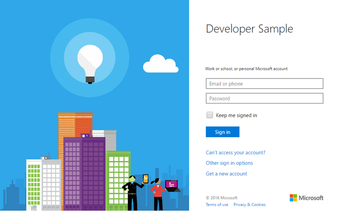

# Get started with Microsoft Graph in a PHP app

This article describes the tasks required to get an access token from the Azure AD v2.0 endpoint and call  Microsoft Graph. It walks you through building the [Connect Sample for PHP](https://github.com/microsoftgraph/php-connect-rest-sample) and explains the main concepts that you implement to use Microsoft Graph. The article also describes how to access Microsoft Graph by using REST calls.

To use Microsoft Graph in your PHP app, you need to show the Microsoft sign in page to your users. The following screenshot shows a sign in page for Microsoft accounts.



**Don't feel like building an app?** Get up and running fast by downloading the [Connect Sample for PHP](https://github.com/microsoftgraph/php-connect-rest-sample) that this article is based on.


## Prerequisites

To get started, you'll need: 

- A [Microsoft account](https://www.outlook.com/) or a [work or school account](http://dev.office.com/devprogram)
- PHP version 5.5.9 or greater
- [Composer](https://getcomposer.org/)


## Register the application
Register an app on the Microsoft App Registration Portal. This generates the app ID and password that you'll use to configure the app.

1. Sign into the [Microsoft App Registration Portal](https://apps.dev.microsoft.com/) using either your personal or work or school account.

2. Choose **Add an app**.

3. Enter a name for the app, and choose **Create application**. 
	
	The registration page displays, listing the properties of your app.

4. Choose **Generate New Password**.

5. Copy the application ID and password.

6. Choose **Add Platform** and **Web**.

7. In the **Redirect URI** field, type `http://localhost:8000/oauth`.

8. Choose **Save**.


## Configure the project

Start a new project using composer. To create a new PHP project using the Laravel framework, use the following command:

```bash
composer create-project --prefer-dist laravel/laravel getstarted
```
 
This creates a **getstarted** folder that you can use for this project.

> Note: You can also use the [Starter project](https://github.com/microsoftgraph/php-connect-rest-sample/tree/master/starter-project) that takes care of the project configuration so you can focus on the coding sections of this walkthrough.

## Authenticate the user and get an access token
Use an OAuth library to simplify the authentication process. [The PHP League](http://thephpleague.com/) provides an [OAuth client library](https://github.com/thephpleague/oauth2-client) that you can use in this project.

### Add the dependency to composer

Open the `composer.json` file and include the following dependency in the **require** section:

```json
"league/oauth2-client": "^1.4"
```

Update the dependencies by running the following command:

```bash
composer update
```

### Start the authentication flow

1. Open the **resources** > **views** > **welcome.blade.php** file. Replace the **title** div element with the following code.
    ```html
    <div class="title" onClick="window.location='/oauth'">Sign in to Microsoft</div>
    ```
    
2. Type-hint the `Illuminate\Http\Request` class on the **app** > **Http** > **routes.php** file. Add the following line before any route declaration.
    ```php
    use Illuminate\Http\Request;
    ```
    
3. Add an */oauth* route to the **app** > **Http** > **routes.php** file. To add the route, copy the following code after the default route declaration. Insert the **application ID** and **password** of your app in the placeholder marked with **\<YOUR_APPLICATION_ID\>** and **\<YOUR_PASSWORD\>** respectively.
    ```php
    Route::get('/oauth', function () {
        $provider = new \League\OAuth2\Client\Provider\GenericProvider([
            'clientId'                => '<YOUR_APPLICATION_ID>',
            'clientSecret'            => '<YOUR_PASSWORD>',
            'redirectUri'             => 'http://localhost:8000/oauth',
            'urlAuthorize'            => 'https://login.microsoftonline.com/common/oauth2/v2.0/authorize',
            'urlAccessToken'          => 'https://login.microsoftonline.com/common/oauth2/v2.0/token',
            'urlResourceOwnerDetails' => '',
            'scopes'                  => 'openid mail.send'
        ]);

        if (!$request->has('code')) {
            return redirect($provider->getAuthorizationUrl());
        }
    });
    ```
    
At this point, you should have a PHP app that displays *Sign in to Microsoft*. If you click the text, the app presents the Microsoft sign-in page. The next step is to handle the code that the authorization server sends to the redirect URI and exchange it for an access token.

### Exchange the authorization code for an access token

You need to handle the authorization server response, which contains a code that you can exchange for an access token.

Update the */oauth* route so it can get an access token with the authorization code. To do this, open the **app** > **Http** > **routes.php** file and add the following *else* conditional clause to the existing *if* statement.

```php
if (!$request->has('code')) {
    ...
    // add the following lines
} else {
    $accessToken = $provider->getAccessToken('authorization_code', [
        'code'     => $request->input('code')
    ]);
    exit($accessToken->getToken());
}
```
    
Note that you have an access token in this line: `exit($accessToken->getToken());`. Now you're ready to add code to call Microsoft Graph. 

## Call Microsoft Graph using REST
You can call Microsoft Graph using REST. Replace the line `exit($accessToken->getToken());` with the following code. Insert your email address in the placeholder marked with **\<YOUR_EMAIL_ADDRESS\>**.

```php
$client = new \GuzzleHttp\Client();

$email = "{
    Message: {
    Subject: 'Sent using the Microsoft Graph REST API',
    Body: {
        ContentType: 'text',
        Content: 'This is the email body'
    },
    ToRecipients: [
        {
            EmailAddress: {
            Address: '<YOUR_EMAIL_ADDRESS>'
            }
        }
    ]
    }}";

$response = $client->request('POST', 'https://graph.microsoft.com/v1.0/me/sendmail', [
    'headers' => [
        'Authorization' => 'Bearer ' . $accessToken->getToken(),
        'Content-Type' => 'application/json;odata.metadata=minimal;odata.streaming=true'
    ],
    'body' => $email
]);
if($response.getStatusCode() === 201) {
    exit('Email sent, check your inbox');
} else {
    exit('There was an error sending the email. Status code: ' . $response.getStatusCode());
}
```

## Run the app
You're ready to try your PHP app.

1. In your shell, type the following command:
    ```bash
    php artisan serve
    ```
    
2. Go to `http://localhost:8000` in your web browser.
3. Choose **Sign in to Microsoft**.
4. Sign in with your personal or work or school account and grant the requested permissions.

Check the inbox of the email address that you configured in [Call the Microsoft Graph using REST](#call-microsoft-graph-using-rest) section. You should have an email from the account that you used to sign in to the app.

## Next steps
- Try out the [Microsoft Graph explorer](https://graph.microsoft.io/graph-explorer).


## See also
* [Azure AD v2.0 protocols](https://azure.microsoft.com/en-us/documentation/articles/active-directory-v2-protocols/)
* [Azure AD v2.0 tokens](https://azure.microsoft.com/en-us/documentation/articles/active-directory-v2-tokens/)
