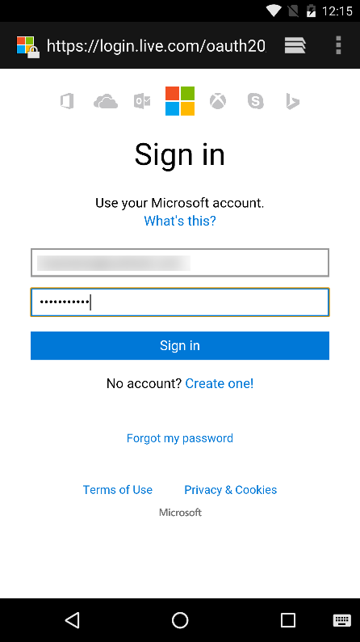

# Get started with the Microsoft Graph in an Android app

This article describes the tasks required to get an access token from the v2 authentication endpoint and call the Microsoft Graph. It walks you through building the [Connect Sample for Android](https://github.com/microsoftgraph/android-java-connect-sample) and explains the main concepts that you implement to use the Microsoft Graph. The article also describes how to access the Microsoft Graph by using either the [Microsoft Graph SDK for Android](https://github.com/microsoftgraph/msgraph-sdk-android) or raw REST calls.

This is the app you'll create. 

**Don't feel like building an app?** Get up and running fast downloading the [Connect Sample for Android](https://github.com/microsoftgraph/android-java-connect-sample) that this walkthrough is based on.

## Prerequisites

To follow along with this walkthrough, you'll need: 

- A [Microsoft account](https://www.outlook.com/) or an [Office 365 for business account](http://dev.office.com/devprogram)
- Android Studio 2.0 or later version

## Register the application
Register an app on the Microsoft App Registration Portal. This generates the app ID and password that you'll use to configure the app in Visual Studio.

1. Sign into the [Microsoft App Registration Portal](https://apps.dev.microsoft.com/) using either your personal or work or school account.

2. Choose **Add an app**.

3. Enter a name for the app, and choose **Create application**. 
	
   The registration page displays, listing the properties of your app.

4. Copy the application ID. This is the unique identifier for your app. 

5. Choose **Add Platform** and **Mobile application**.

    > Note: The Application Registration Portal provides a Redirect URI with a value of *urn:ietf:wg:oauth:2.0:oob*. However, we'll use the default Redirect URI value of *https://login.microsoftonline.com/common/oauth2/nativeclient*.

6. Choose **Save**.

## Configure the project

Start a new project in Android Studio. You can leave the default values for most of the wizard, just make sure to choose the following options:

* Target Android Devices - **Phone and Tablet**
    * Minimum SDK - **API 16: Android 4.1 (Jelly Bean)**
* Add an Activity to Mobile - **Basic Activity**
 
This provides us with an Android project with an activity and a button that we can use to authenticate the user.

## Authenticate the user and get an access token

Now you're ready to add code to call the Microsoft Graph. 

## Call the Microsoft Graph
If you're using the Microsoft Graph SDK, read on. If you're using REST, jump to the [Using the REST API](#using-the-rest-api) section.

### Using the SDK

### Using the REST API

## Run the app

## Next steps
- Try out the REST API using the [Graph explorer](https://graph.microsoft.io/graph-explorer).
- Find examples of common operations in the [Snippets Sample for Android](https://github.com/microsoftgraph/android-java-snippets-sample), or explore our other [Android samples](https://github.com/microsoftgraph?utf8=%E2%9C%93&query=android) on GitHub.

## See also
