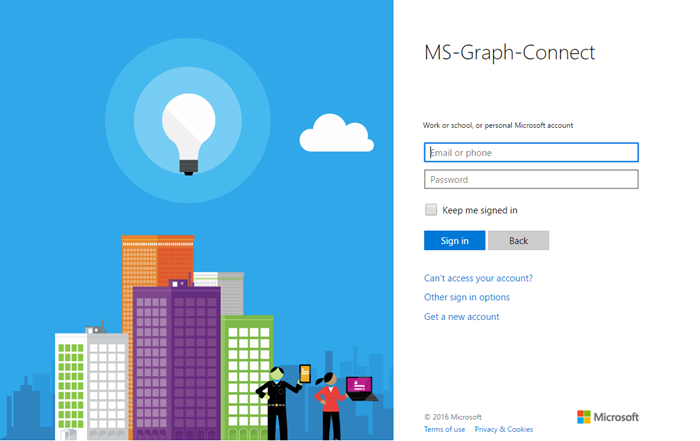

# Get started with the Microsoft Graph in a PHP app

This article describes the tasks required to get an access token from the v2 authentication endpoint and call the Microsoft Graph. It walks you through building the [Connect Sample for PHP](https://github.com/microsoftgraph/php-connect-rest-sample) and explains the main concepts that you implement to use the Microsoft Graph. The article also describes how to access the Microsoft Graph by using REST calls.

This article shows how to perform specific tasks that you need to follow to use the Microsoft Graph in your PHP app. For example, you need to show the Microsoft sign in page to your users. Here's a screenshot of the sign in page for Microsoft accounts.



**Don't feel like building an app?** Get up and running fast downloading the [Connect Sample for PHP](https://github.com/microsoftgraph/php-connect-rest-sample) that this walkthrough is based on.


## Prerequisites

To follow along with this walkthrough, you'll need: 

- A [Microsoft account](https://www.outlook.com/) or an [Office 365 for business account](http://dev.office.com/devprogram)
- PHP version 5.5.9 or greater
- [Composer](https://getcomposer.org/)


## Register the application
Register an app on the Microsoft App Registration Portal. This generates the app ID and password that you'll use to configure the app.

1. Sign into the [Microsoft App Registration Portal](https://apps.dev.microsoft.com/) using either your personal or work or school account.

2. Choose **Add an app**.

3. Enter a name for the app, and choose **Create application**. 
	
   The registration page displays, listing the properties of your app.

4. Choose **Generate New Password**.

5. Copy the application ID and password.

6. Choose **Add Platform** and **Web**.

7. In the **Redirect URI** field, type `http://localhost:8000/oauth.php`.

8. Choose **Save**.


## Configure the project

Start a new project using composer. To create a new PHP project using the Laravel framework, type the following command:

```bash
composer create-project --prefer-dist laravel/laravel getstarted
```
 
This creates a **getstarted** folder that we can use for this project.

## Authenticate the user and get an access token
We'll use an OAuth library to simplify the authentication process. [The PHP League](http://thephpleague.com/) provides an [OAuth client library](https://github.com/thephpleague/oauth2-client) that we can use in this project.

### Add the dependency to composer

Open the `composer.json` file and include the following dependency in the **require** section:

```json
"league/oauth2-client": "^1.4"
```

### Start the authentication flow

1. Open the **resources** > **views** > **welcome.blade.php** file. Replce the **title** div element with the following code.
    ```html
    <div class="title" onClick="window.location='/oauth'">Sign in to Microsoft</div>
    ```
    
2. Open the **app** > **Http** > **routes.php** file and add the following code. Insert the **application ID** and **password** of your app in the placeholder marked with **\<YOUR_APPLICATION_ID\>** and **\<YOUR_PASSWORD\>** respectively.
    ```php
    Route::get('/oauth', function () {
        $provider = new \League\OAuth2\Client\Provider\GenericProvider([
            'clientId'                => '<YOUR_APPLICATION_ID>',
            'clientSecret'            => '<YOUR_PASSWORD>,
            'redirectUri'             => 'http://localhost:8000/oauth',
            'urlAuthorize'            => 'https://login.microsoftonline.com/common/oauth2/v2.0/authorize',
            'urlAccessToken'          => 'https://login.microsoftonline.com/common/oauth2/v2.0/token',
            'urlResourceOwnerDetails' => '',
            'scopes'                  => 'openid mail.send'
        ]);

        if (!isset($_GET['code'])) {
            // The OAuth library automaticaly generates a state value that we can
            // validate later. We just save it for now.
            session(['state' => $provider->getState()]);
            return redirect($provider->getAuthorizationUrl());
        }
    });
    ```
    
At this point, you should have a PHP app that displays *Sign in to Microsoft*. If you click the text, the app presents the Microsoft sign-in page. The next step is to handle the code that the authorization server sends to the redirect URI and exchange it for an access token.

### Exchange the authorization code for an access token

We need to make our app ready to handle the authorization server response, which contains a code that we can exchange for an access token.

1. We need to tell the Android system that the app can handle requests to *https://login.microsoftonline.com/common/oauth2/nativeclient*. To do this open the **AndroidManifest** file and add the following activity element.
    ```xml
    <activity android:name="net.openid.appauth.RedirectUriReceiverActivity">
        <intent-filter>
            <action android:name="android.intent.action.VIEW"/>
            <category android:name="android.intent.category.DEFAULT"/>
            <category android:name="android.intent.category.BROWSABLE"/>
            <data android:scheme="https"/>
            <data android:host="login.microsoftonline.com"/>
            <data android:path="/common/oauth2/nativeclient"/>
        </intent-filter>
    </activity>
    ```

2. The activity will be invoked when the authorization server sends a response. We can request an access token with the response from the authorization server. Go back to your **MainActivity** and append the following code to the **onCreate** method.
    ```java
    Bundle extras = getIntent().getExtras();
    if (extras != null) {
        AuthorizationResponse authorizationResponse = AuthorizationResponse.fromIntent(getIntent());
        AuthorizationException authorizationException = AuthorizationException.fromIntent(getIntent());
        final AuthState authState = new AuthState(authorizationResponse, authorizationException);

        if (authorizationResponse != null) {
            HashMap<String, String> additionalParams = new HashMap<>();
            TokenRequest tokenRequest = authorizationResponse.createTokenExchangeRequest(additionalParams);

            authorizationService.performTokenRequest(
                tokenRequest,
                new AuthorizationService.TokenResponseCallback() {
                    @Override
                    public void onTokenRequestCompleted(
                            @Nullable TokenResponse tokenResponse,
                            @Nullable AuthorizationException ex) {
                        authState.update(tokenResponse, ex);
                        if (tokenResponse != null) {
                            String accessToken = tokenResponse.accessToken;
                        }
                    }
                });
        } else {
            Log.i("MainActivity", "Authorization failed: " + authorizationException);
        }
    }
    ```

Note that we have an access token in this line `String accessToken = tokenResponse.accessToken;`. Now you're ready to add code to call the Microsoft Graph. 

## Call the Microsoft Graph
If you're using the Microsoft Graph SDK, read on. If you're using REST, jump to the [Using the Microsoft Graph REST API](#using-the-microsoft-graph-rest-api) section.

### Using the Microsoft Graph SDK
The [Microsoft Graph SDK for Android](https://github.com/microsoftgraph/msgraph-sdk-android) provides classes that builds requests and process results from the Microsoft Graph API. Follow these steps to use the Microsoft Graph SDK.

1. Add internet permissions to your app. Open the **AndroidManifest** file and add the following child to the manifest element.
    ```xml
    <uses-permission android:name="android.permission.INTERNET" />
    ```

2. Add dependencies to the Microsoft Graph SDK and GSON.
   ```gradle
    compile 'com.microsoft.graph:msgraph-sdk-android:1.0.0'
    compile 'com.google.code.gson:gson:2.4'
   ```
   
3. Replace the line `String accessToken = tokenResponse.accessToken;` with the following code. Insert your email address in the placeholder marked with **\<YOUR_EMAIL_ADDRESS\>**.
    ```java
    final String accessToken = tokenResponse.accessToken;
    final IClientConfig clientConfig = 
            DefaultClientConfig.createWithAuthenticationProvider(new IAuthenticationProvider() {
        @Override
        public void authenticateRequest(IHttpRequest request) {
            request.addHeader("Authorization", "Bearer " + accessToken);
        }
    });

    final IGraphServiceClient graphServiceClient = new GraphServiceClient
        .Builder()
        .fromConfig(clientConfig)
        .buildClient();

    final Message message = new Message();
    EmailAddress emailAddress = new EmailAddress();
    emailAddress.address = "<YOUR_EMAIL_ADDRESS>";
    Recipient recipient = new Recipient();
    recipient.emailAddress = emailAddress;
    message.toRecipients = Collections.singletonList(recipient);
    ItemBody itemBody = new ItemBody();
    itemBody.content = "This is the email body";
    itemBody.contentType = BodyType.text;
    message.body = itemBody;
    message.subject = "Sent using the Microsoft Graph SDK";

    AsyncTask.execute(new Runnable() {
        @Override
        public void run() {
            graphServiceClient
                .getMe()
                .getSendMail(message, false)
                .buildRequest()
                .post();
        }
    });
    ```

### Using the Microsoft Graph REST API
The [Microsoft Graph REST API](http://graph.microsoft.io/docs) exposes multiple APIs from Microsoft cloud services through a single REST API endpoint. Follow these steps to use the REST API.

1. Add internet permissions to your app. Open the **AndroidManifest** file and add the following child to the manifest element.
    ```xml
    <uses-permission android:name="android.permission.INTERNET" />
    ```

2. Add a dependency to the Volley HTTP library.
   ```gradle
    compile 'com.android.volley:volley:1.0.0'
   ```
   
3. Replace the line `String accessToken = tokenResponse.accessToken;` with the following code. Insert your email address in the placeholder marked with **\<YOUR_EMAIL_ADDRESS\>**.
    ```java
    final String accessToken = tokenResponse.accessToken;

    final RequestQueue queue = Volley.newRequestQueue(getApplicationContext());
    String url ="https://graph.microsoft.com/v1.0/me/sendMail";
    final String body = "{" +
        "  Message: {" +
        "    subject: 'Sent using the Microsoft Graph REST API'," +
        "    body: {" +
        "      contentType: 'text'," +
        "      content: 'This is the email body'" +
        "    }," +
        "    toRecipients: [" +
        "      {" +
        "        emailAddress: {" +
        "          address: '<YOUR_EMAIL_ADDRESS>'" +
        "        }" +
        "      }" +
        "    ]}" +
        "}";

    final StringRequest stringRequest = new StringRequest(Request.Method.POST, url,
        new Response.Listener<String>() {
            @Override
            public void onResponse(String response) {
                Log.d("Response", response);
            }
        },
        new Response.ErrorListener() {
            @Override
            public void onErrorResponse(VolleyError error) {
                Log.d("ERROR","error => " + error.getMessage());
            }
        }
    ) {
        @Override
        public Map<String, String> getHeaders() throws AuthFailureError {
            Map<String,String> params = new HashMap<>();
            params.put("Authorization", "Bearer " + accessToken);
            params.put("Content-Length", String.valueOf(body.getBytes().length));
            return params;
        }
        @Override
        public String getBodyContentType() {
            return "application/json";
        }
        @Override
        public byte[] getBody() throws AuthFailureError {
            return body.getBytes();
        }
    };

    AsyncTask.execute(new Runnable() {
        @Override
        public void run() {
            queue.add(stringRequest);
        }
    });
    ```

## Run the app
You're ready to try your PHP app.

1. In your shell type the following command:
    ```bash
    php artisan serve
    ```
    
2. Navigate to `http://localhost:8000` in your web browser.
3. Choose **Sign in to Microsoft**.
4. Sign in with your personal or work or school account and grant the requested permissions.

Check the inbox of the email address that you configured in [Call the Microsoft Graph](#call-the-microsoft-graph) section. You should have an email from the account that you used to sign in to the app.

## Next steps
- Try out the REST API using the [Graph explorer](https://graph.microsoft.io/graph-explorer).


## See also
* [Overview of Microsoft Graph](http://graph.microsoft.io/docs)
* [Azure AD v2.0 protocols](https://azure.microsoft.com/en-us/documentation/articles/active-directory-v2-protocols/)
* [Azure AD v2.0 tokens](https://azure.microsoft.com/en-us/documentation/articles/active-directory-v2-tokens/)
